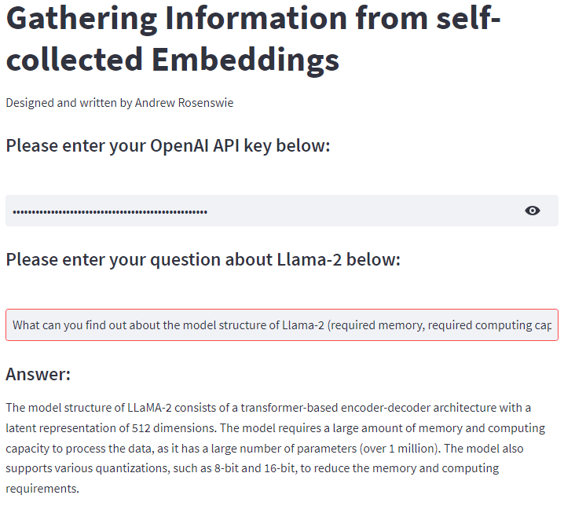

# Algonaut Coding Task

Provided below are the steps to create a question-answer tool via Streamlit. This was created with the text-davinci-003 model with inference temperature=0.1.  All of the codes are located in the folder:  'coding_exercise_algonaut'.

## Step 1:
Create a virtual environment with python or conda:
```
conda create -n myenv python=3.11.1
conda activate myenv
```
## Step 2:
Then update pip:
```
pip install --upgrade pip
```
## Step 3:
Clone the repository, and install the required packages which are in requirements.txt:
```
pip install -r requirements.txt
```
## Step 4:
Locate 'main.py' file via terminal, and then type: ```streamlit run main.py``` in order to run Streamlit application.  

There will be an error message that should state the following:  

*AuthenticationError: You didn't provide an API key. You need to provide your API key in an Authorization header using Bearer auth (i.e. Authorization: Bearer YOUR_KEY), or as the password field (with blank username) if you're accessing the API from your browser and are prompted for a username and password. You can obtain an API key from https://platform.openai.com/account/api-keys.*

You can ignore this, since when you input your personal OpenAI API key, the error will go away.  
## Step 5:
You can type one of the following questions into the given textbox:
- For which tasks has Llama-2 already been used successfully?
- What are promising areas of application for Llama-2?
- Name at least 5 domain-specific LLMs that have been created by fine-tuning Llama-2.
- What can you find out about the model structure of Llama-2 (required memory, required computing capacity, number of parameters, available quantizations)?
## Step 6:
Hit Enter, and wait for the output to appear. When finished, it should look like this: 




## Notes:

There is a three second delay that is in accordance with arXiv, [found here](https://info.arxiv.org/help/api/tou.html).
